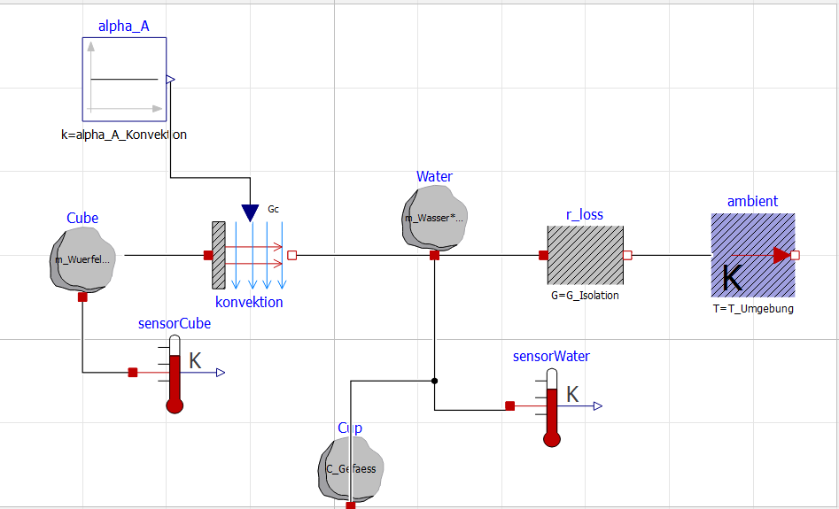
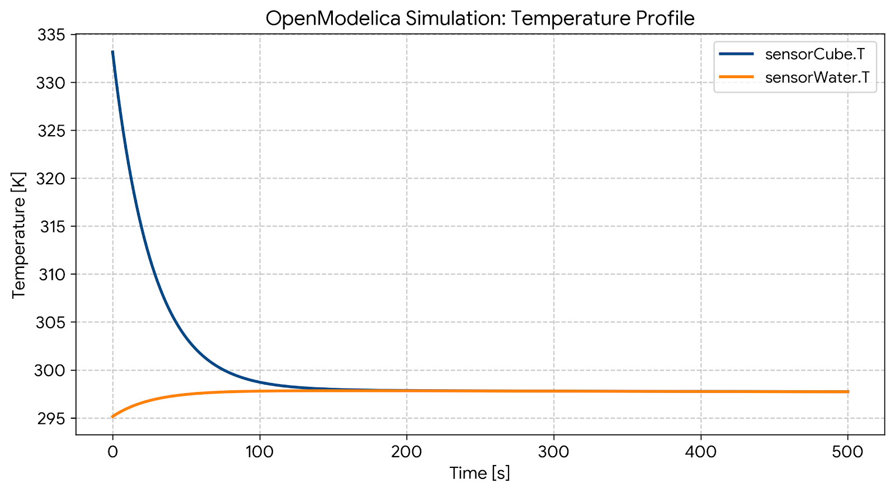

# OpenModelica: Digitaler Zwilling

Dieser Ordner enthält das physikalische Simulationsmodell des Wärmekapazitäts-Versuchs, erstellt mit OpenModelica. Es dient dazu, den theoretischen Temperaturverlauf zu simulieren und mit den realen, über Python erfassten Sensordaten zu vergleichen.

## Verwendung in OMEdit

1. Die Datei `HeatCapacity_Experiment.mo` in OMEdit öffnen (Modellname: `HeatCapacity_TableTopExperiment_MaterialSelection`).
2. In die **Diagrammansicht** (Diagram View) wechseln.
3. Doppelt auf den leeren Hintergrund klicken, um das Parametermenü zu öffnen. Dort das Material auswählen (`materialSelection`):
   * `1` = Aluminium
   * `2` = Kupfer
   * `3` = Stahl
4. Auf **Simulate** klicken.

## Starttemperaturen

In der Voreinstellung simuliert das Modell einen heißen Würfel (`T_Wuerfel_Start` = 60 °C) in kaltem Wasser (`T_Wasser_Start` = 22 °C). Im realen Versuch ist es umgekehrt: Der Würfel hat Raumtemperatur und wird in Wasser von ca. 60 °C getaucht. Für einen direkten Vergleich mit Messdaten die beiden Parameter entsprechend tauschen und `T_Umgebung` auf die gemessene Raumtemperatur setzen. Die Auswertungsgleichungen im Modell gelten für beide Richtungen des Wärmeflusses.

## Kalibrierung

Der Parameter `alpha_A_Konvektion` (Wärmeübergang Würfel–Wasser, α·A in W/K) ist im Modell auf `3.5` kalibriert. Mit diesem Wert stellt sich das thermische Gleichgewicht zwischen Aluminiumwürfel und Wasser in der Simulation nach etwa 110 Sekunden ein, wie im realen Laboraufbau.

Der Parameter `G_Isolation` entspricht dem Wärmeverlustkoeffizienten `K_WERT` der Python-Auswertung. Nach einer neuen Kalibrierung (siehe `03_Documentation/MANUAL.md`, Abschnitt 2) sollte er auf denselben Wert gesetzt werden.
